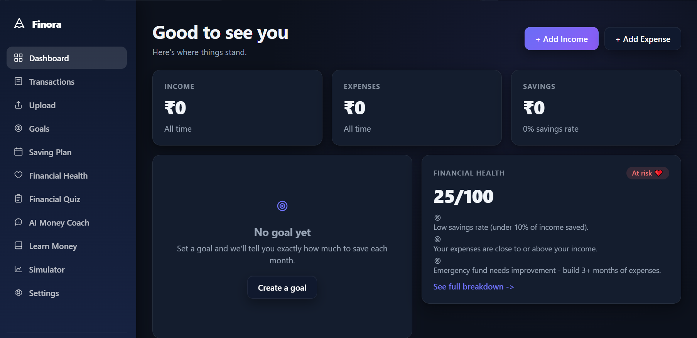
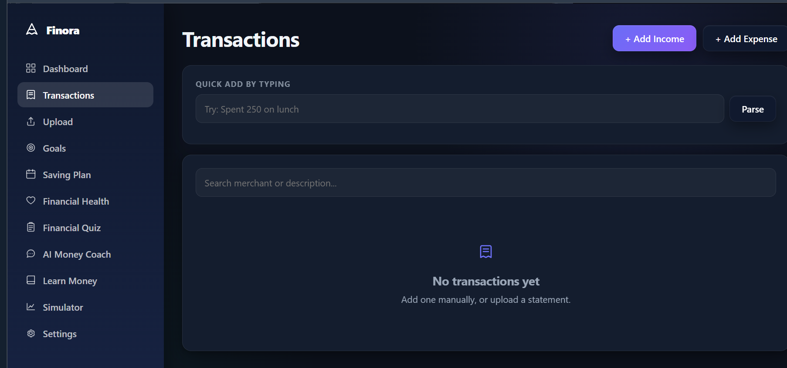
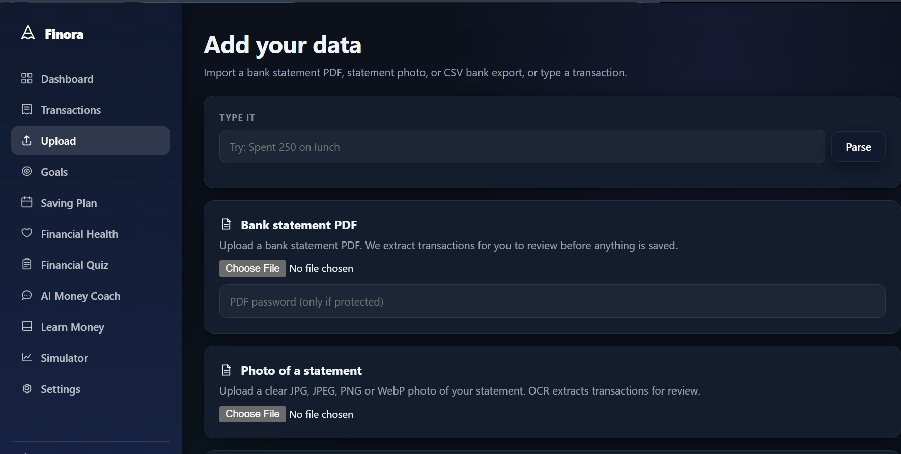
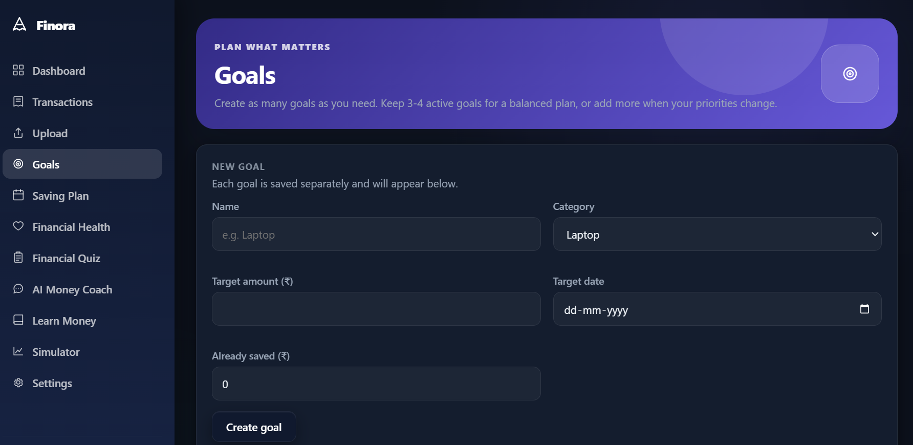
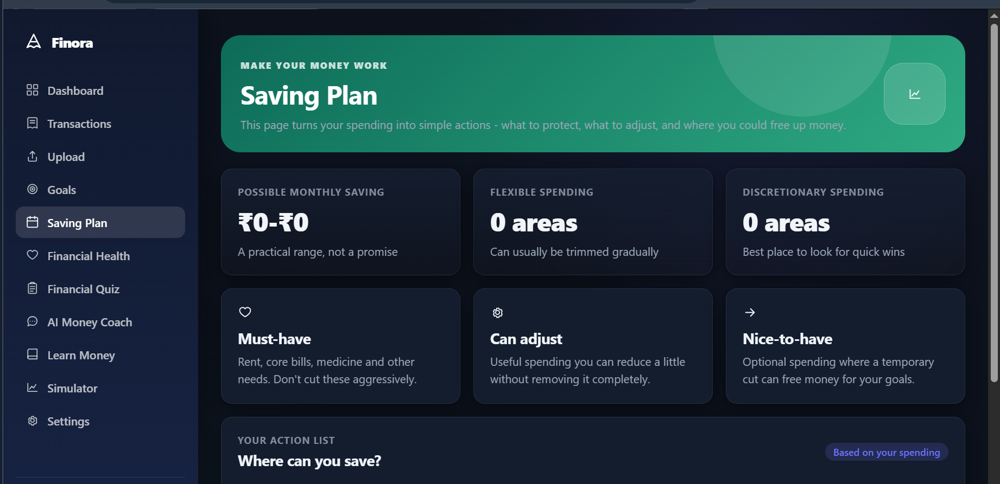

# Finora — AI-Powered Personal Finance Platform


> **Understand your money. Plan with confidence. Build better habits.**

Finora is a personal finance platform designed to help users understand their spending, plan financial goals, improve saving habits, and learn essential financial concepts through a simple and approachable experience.

## Features

- **Personalized onboarding** with manual entry, statement import, and beginner-friendly estimates
- **Transaction management** for recording, editing, reviewing, and organizing income and expenses
- **Statement import** with CSV/PDF processing and review-before-confirmation workflows
- **Automatic categorization** using rule-based classification with an ML fallback
- **Spending analytics** for income, expenses, savings, categories, and trends
- **Financial Health Score** with transparent explanations and actionable insights
- **Savings Planner** with practical, category-based saving suggestions
- **Financial Goals** with progress tracking and monthly saving guidance
- **AI Money Coach** for contextual financial explanations and guidance
- **Financial learning modules** covering saving, compounding, SIPs, risk, and other core concepts
- **Investment Simulator** for illustrative compound-growth calculations
- **Authentication and privacy controls** with protected user data and account-level actions

## Screenshots

| Dashboard | Transactions |
|---|---|
|  |  |

| Add Data / Upload | Goals |
|---|---|
|  |  |

| Saving Plan |
|---|
|  |

## Tech Stack

### Backend
- Python
- FastAPI
- SQLModel / SQLAlchemy
- Pydantic Settings
- SQLite
- Pandas
- Scikit-learn
- JWT authentication
- OCR with Tesseract

### Frontend
- HTML
- CSS
- Vanilla JavaScript
- Responsive, hash-based client-side navigation

### DevOps
- Docker
- Docker Compose

## Project Structure

```text
finora/
├── backend/
│   ├── app/
│   │   ├── routers/
│   │   ├── services/
│   │   ├── main.py
│   │   ├── models.py
│   │   ├── schemas.py
│   │   ├── database.py
│   │   ├── auth.py
│   │   └── config.py
│   ├── tests/
│   └── requirements.txt
├── frontend/
│   ├── templates/
│   └── static/
├── Dockerfile
├── docker-compose.yml
├── .env.example
└── README.md
```

## Getting Started

### 1. Clone the repository

```bash
git clone https://github.com/Vaibhav03050/finora-personal-finance-platform.git
cd finora-personal-finance-platform
```

### 2. Create and activate a virtual environment

```bash
python -m venv .venv
```

**Windows:**

```bash
.venv\Scripts\activate
```

**macOS / Linux:**

```bash
source .venv/bin/activate
```

### 3. Install dependencies

```bash
pip install -r backend/requirements.txt
```

### 4. Configure environment variables

Create a `.env` file from the example:

```bash
copy .env.example .env
```

For macOS/Linux:

```bash
cp .env.example .env
```

Update the environment values before running the application.

### 5. Start the application

From the project root:

```bash
uvicorn backend.app.main:app --reload
```

Open the application in your browser using the local URL shown by Uvicorn.

### Docker

To run Finora with Docker Compose:

```bash
docker compose up --build
```

To stop the services:

```bash
docker compose down
```

## Testing

Run the backend test suite from the project root:

```bash
pytest backend/tests -q
```

## Security

- Keep secrets in environment variables.
- Do not commit `.env` files or private credentials.
- Use a strong production secret key.
- Review uploaded financial documents before confirming imported transactions.
- Use HTTPS and production-ready configuration when deploying publicly.

## Disclaimer

Finora is an educational and personal financial management application. Its calculations, simulations, and suggestions are intended for informational purposes and should not be treated as guaranteed financial advice or investment recommendations.

## License

This project is licensed under the [MIT License](LICENSE).

## Author

**Vaibhav Mittal**

- GitHub: [Vaibhav03050](https://github.com/Vaibhav03050)
- LinkedIn: [Vaibhav Mittal](https://www.linkedin.com/in/vaibhav-mittal-672621325/)
